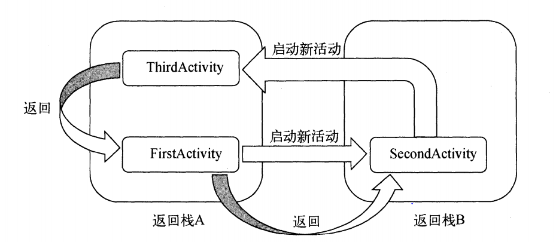

#Android活动认识　

 

###对安卓程序运行的初步理解

1. AndroidManifest文件中注册活动，指定活动类型
2. 在对应lay_out文件中确定该活动界面的布局
3. 在java文件中定义活动行为

其实这么看来跟之前学过的前端开发也是很相似的，HTML和JS分开，连getelementbyId这个方法名字都差不多

###一些简单的方法

+ Toast
+ Menu的创建
+ Finish（）

###活动之间的交互

####使用显式Intent

`Intent intent = new Intent(FirstActivity.this, SecondActivity.class)`

也就是说直接的从A调用到B

####隐式Intent

`Intent intent = new Intent("XXX.ACTION.START")`

`startActivity(intent)`

在对应注册的活动中，会有具体的catagroy对应，找到对应的catagroy就会启动该活动
在安卓系统中有很多已经注册好的活动可供隐式调用，比如拨打电话

####上下活动之间的交互

+ 上到下

	+ 使用intent将第二个活动启动，并将intent中加入需要的数据
	+ 第二个活动从intent中获取需要的数据`getIntent()`

+ 下到上

	+ 首先从第一个活动通过`startActivityForResult()`方法来启动下一个活动
	+ 第二个活动中注意使用`setResult（）`来返回结果码以及数据
	+ 由于已经是通过`startActivityForResult（）`来启动的第二个活动，在返回的时候是会调用回调函数`onActivityResult（）`函数的，重写一下就可以了

####活动的生命周期

+ 完整生存期

	Time between onCreat() and onDestroy()

+ 可见生存期

	Time between onStart() and onStop()

+ 前台生存期

	Time between onResume() and onPause()
 
 

	还有一个没有提及的方法：onDestroy（）这是在活动销毁之前调用

####返回活动时活动被回收

咋会被回收的活动中重写`onSaveInstanceState(Bundle outState)`
由于被回收的再返回是会被创建的
所以在onCreate中使用Bundle参数进行重写就可以了

###活动的启动模式

####standard

就是正常的默认方式，他不会管那么多，如果已经创建了依旧是可以在栈顶继续创建的

####singleTop
若栈顶已经是要继续创建的活动则不会继续创建

####singleTask
不是在栈顶依旧是会调用在栈中的活动不会新创建

####singleInstance
会开启一个新的栈！如图所示

###Others

####获取当前活动
	添加简单方法然后继承即可

####随时关闭程序
	天剑任务管理器，点击按钮全部清除任务即可

